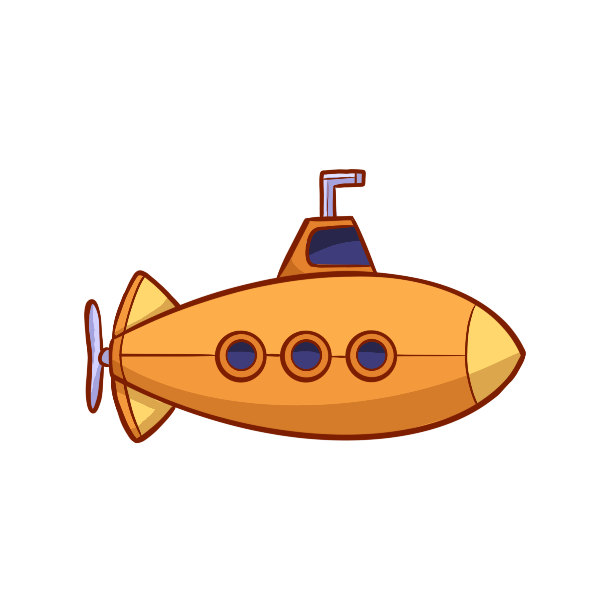
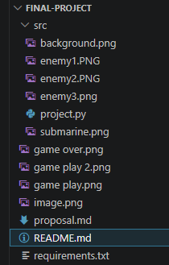

# final-project
# Submerged Survival



## Demo
Demo Video: 

## GitHub Repository
GitHub Repo: 

## Description

Submerged Survival is a fast-paced 2D arcade survival game developed using **Python + Pygame**.  In this game, the player controls a submarine that can move left and right across the screen to dodge incoming enemies. The objective is to survive as long as possible while enemies continuously spawn and increase in number and speed over time.  The player earns points whenever  an enemy successfully passes off the screen without colliding with the submarine. 

The project is built in a single Python file that manages the game loop, player movement, rendering, collision detection, and difficulty.  It uses image assets such as background, a submarine, and enemy sprites to create the visuals.  Collision detection is handled using Pygame masks, which makes interactions more accurate than basic rectangle collisions. The use of masks were used for precise detection allowing the submarine to flip based on its direction path.  Rendering was improved by organizing how objects were drawn on the screen.

Overall, the project demonstrates important programming concepts such as game loops, user input, state management, and collision detection using Python. 

---

## Gameplay 
- Move a submarine left and right to avoid enemies
- Enemies spawn randomly and fall downward
- Score increases when enemies pass safely
- Difficulty increases over time (speed + more enemies)
- Game ends on collision
- Press **R** to restart

### Gameplay Preview


### Game Over Screen


---

## Controls

| Key | Action |
|-----|--------|
|➡️ Right Arrow | Move right |
|⬅️ Left Arrow | Move left |
| R | Restart game (after game over) |
| Close Window | Exit game |

## Features
- Smooth 2D submarine movement
- Random enemy spawning
- Increasing difficulty over time
- Pixel-perfect collision detection using 'pygame.mask'
- Game over and Restart system
- Score tracking

---

## Project Structure


---

## Installation

Install dependencies using:

```bash
pip install -r requirements.txt

## Challenges

During this project, I learned how to use Pygame for game development, including handling real-time user input, managing game loop, and implementing collision detection using masks.  Working with sprite transformations, such as flipping images based on direction.  Additionally, structuring the game using a state-based system helped improve organization and made features like restarting easier to execute.


